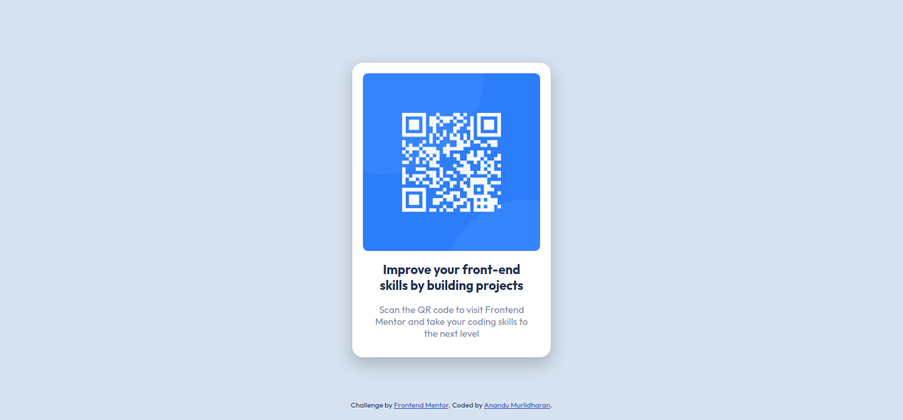

# Frontend Mentor - QR code component solution

This is a solution to the [QR code component challenge on Frontend Mentor](https://www.frontendmentor.io/challenges/qr-code-component-iux_sIO_H). Frontend Mentor challenges help you improve your coding skills by building realistic projects. 

## Table of contents

- [Overview](#overview)
  - [The Challenge](#the-challenge)
  - [Screenshot](#screenshot)
  - [Links](#links)
- [My process](#my-process)
  - [Built with](#built-with)
- [Author](#author)

## Overview

### The Challenge
Create layout as close to design. 

### Screenshot

 The Desktop Version.

  The mobile version.

### Links

- [Solution URL:](https://github.com/anandumurli/FrontendMentor_QR_Code)
- [Live Site URL:](https://anandumurli.github.io/FrontendMentor_QR_Code/)

## My process
Followed mobile first approach to create the project.

### Built with

- Semantic HTML5 markup
- Flexbox
- Mobile-first workflow

## Author

- Frontend Mentor - [@anandumurli](https://www.frontendmentor.io/profile/anandumurli)

